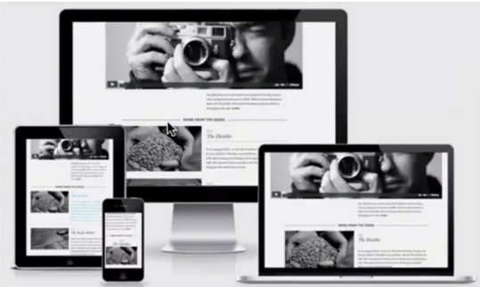

# What is responsive design

 

# Why responsive design
- search engines like Google are more friendly to website that are responsive based on silent viewport
- it improves user experience exponentially.

 

# how to implement responsive design
- use vw, % units. 
- use media queries to address breakpoints.

Tip: when developing website, try to design for all 
Types of viewport monitor, laptop, tablet, smartphone
And address their breakpoints using media queries.
