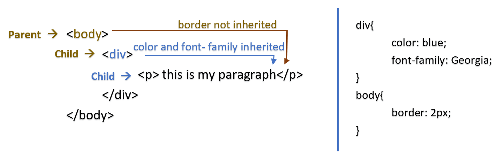

# How CSS is rendered and applied
***if you ever got into a problem where, element’s style is not looking or behaving like you intended.  
this is a very common problem and below can be the solution.***

_"Conflicts between CSS rules addressing the same element may arise. 
Most of them can be solved by considering the rules of cascading order and inheritance._"

<br/>

## CASCADING ORDER &nbsp;&nbsp;&nbsp; “cascading means flowing down”
HTML documents are loaded and read sequentially from top to bottom, so it is important where a style attribute is declared. 
<br/>CSS rules written further below in a file will be read and interpreted later than the ones at the top. 
<br/>This applies for one CSS file as well as for the whole HTML document incorporating many styles. 

<br/>

<details>
<summary><b>
Que: what happens when we have two different rules for same element?
</b></summary>
<p>
 
**Ans:** the last rule being read will get applied to the element.

<br/> 
</p>
</details>


<details>
<summary><b>
Que: but what happens when we add inline CSS? while having rule with same property for same element in external  CSS.
</b></summary>
<p>
 
**Ans:** in case of external CSS and inline CSS, rules in the CSS file will get ignored. and inline CSS will get applied.
The reason is that the reference to CSS file being in head, firstly external CSS is loaded in the background. Subsequently, the inline CSS is loaded and interpreted together with the HTML file and therefore overwrites the previous rules.

**note:** _if there are two different rules for different properties for same element then both rules are applied, even if they are in different external files and even if one is inline while other is external._
 
<br/>
</p>
</details>


<details>
<summary><b>
Que: what happens when external and internal CSS come together?
</b></summary>
<p>
 
**Ans:** this is easy. It depends on the order in which they are declared. 
when first an external style is referenced and then  the internal style will be applied. 
the last rules being interpreted will result in final style .
 
</p>
</details>

<br/>

<details>
<summary>
💡 <b><em> tip: </em></b>
</summary>
<p>
 
- When using all three variants of CSS (e.g. on big websites) you usually reference the external styles first, then apply an internal CSS to the HTML file (e.g. a subsite), and then sometimes use inline CSS for quick tests.
 
***For this scenario the cascading order would be:	“cascading means flowing down”***
1.	The browsers default is applied first (= the user settings).
2.	Then the external styles are loaded.
3.	Then the internal style is added.
4.	And finally the inline style is applied.
</p>
</details>

<br/>
 
<br/>

***Besides the cascading order, there is another main reason why an HTML element’s style might not look or behave like you intended.***

<br/>

## INHERITANCE of properties from Parent element by Child elements in HTML 
In case of nested elements inside HTML, 
***There are two kinds of style “properties”:*** 
- those that are, always inherited (_they have values inherited from parent element)._ 
- and those that are, not inherited by default, _and have initial (default values)._

<details>
<summary><b><em> example: </em></b></summary>
<p> 

<div align="center">

</div>
 
**note:** Here, the color property as well as the font-size property are inherited automatically, whereas the border property is not inherited.
</p> 
</details>

<details>
<summary>
 💡 <b><em> tip: </b></em>
</summary>
<p>

In many cases you have to find out yourself what properties are inherited and which not. But as a rule of thumb, most text- and font-related properties are inherited and everything size- and positioning-related is not. 
<br/>You can take a look at <a href="https://www.w3.org/TR/CSS21/propidx.html" title="W3 school"> _this_ </a> slightly outdated list of properties and their inheritance status. 
</p>
</details>

<br/>

### Controlling Inheritance
***also, you can manually overwrite inherited properties or force inheritance.***

#### Inherit
Child element inherit style properties from Parent element.
**Ex:**
```HTML
<div style= “color: blue;”>
        <p style= “color: inherit; ”> HELLO! </p>
</div> 
```

#### Initial
Child element use its default value for the property. “remember they are set by browser”
**Ex:**
```HTML
<div style= “color: blue;”>
        <p style= “color: initial; ”> HELLO! </p>
</div>
```

#### Unset
The unset  CSS keyword resets a property to its inherited value if the property naturally inherits from its parent, and to its initial value if not.


