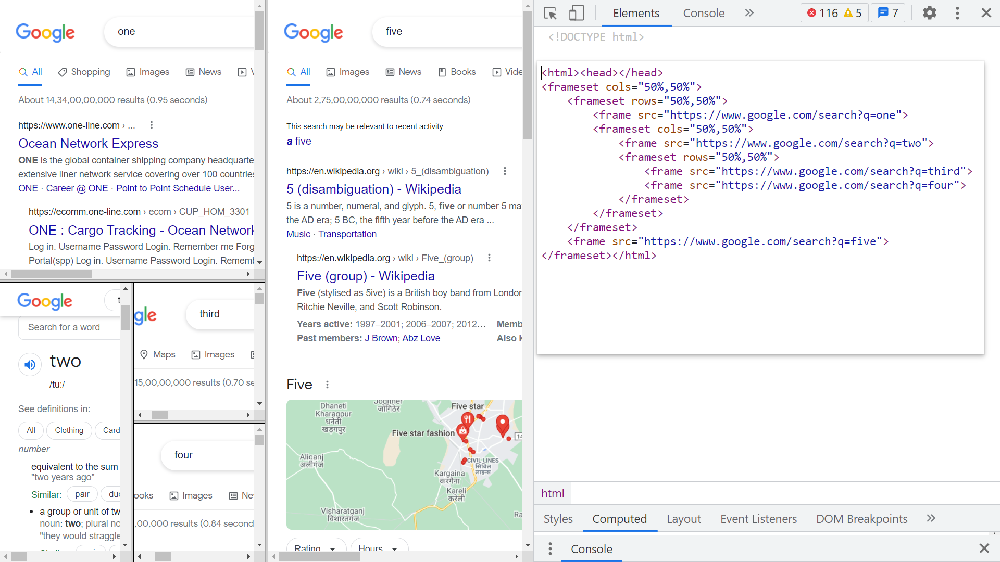

## Frame tag:
<div align="center">
 
</div>
 
<br/>**note:** frame element has attribute ``name = “ ”`` that allows us to name the frame. 
<br/>**tip:** now see target attribute of anchor tag and you’ll understand the importance of frames.


<br/>

## iframe:
```html
<iframe src=”linktodata” frameborder=”0” width=”500” scrolling=“no”> <iframe>
```
**tip:** The <iframe> tag specifies an inline frame.
<br/>An inline frame is used to embed another document within the current HTML document.
<br/>iframe is Primarily used to include resources from other domains or subdomains but can be used to include content from the same domain as well. 
<br/>The <iframe>'s strength is that the embedded code is 'live' i.e. dynamic and can communicate with the parent document.
 
<br/> 
 
# frame vs iframe ?
 
